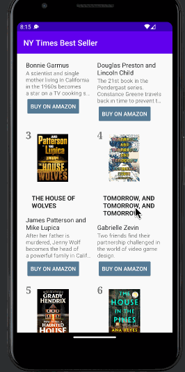

# NYTBooks
An app that allows the user to scroll through a list of books

**NYTBooks** is a book browsing app that allows users to browse the Best Seller Books on New York Times.

## Required Features

The following **required** functionality is completed:

- [x] **Make a request to "https://api.nytimes.com/svc/books/v3/lists/current/hardcover-fiction.json" endpoint to get a list of best seller books**
- [x] **Parse through JSON data and implement a RecyclerView to display all books**
- [x] **Use Glide to load and display book images**

The following **optional** features are implemented:

- [x] Improve and customize the user interface through styling and coloring
- [x] The "Buy" button successfully opens the page on Amazon

## Video Walkthrough

Here's a walkthrough of implemented user stories:

<!-- Replace this with whatever GIF tool you used! -->
GIF created with LICEcap
<!-- Recommended tools:
[Kap](https://getkap.co/) for macOS
[ScreenToGif](https://www.screentogif.com/) for Windows
[peek](https://github.com/phw/peek) for Linux. -->

## License

    Copyright [2022] [Peilin Chen]

    Licensed under the Apache License, Version 2.0 (the "License");
    you may not use this file except in compliance with the License.
    You may obtain a copy of the License at

        http://www.apache.org/licenses/LICENSE-2.0

    Unless required by applicable law or agreed to in writing, software
    distributed under the License is distributed on an "AS IS" BASIS,
    WITHOUT WARRANTIES OR CONDITIONS OF ANY KIND, either express or implied.
    See the License for the specific language governing permissions and
    limitations under the License.
